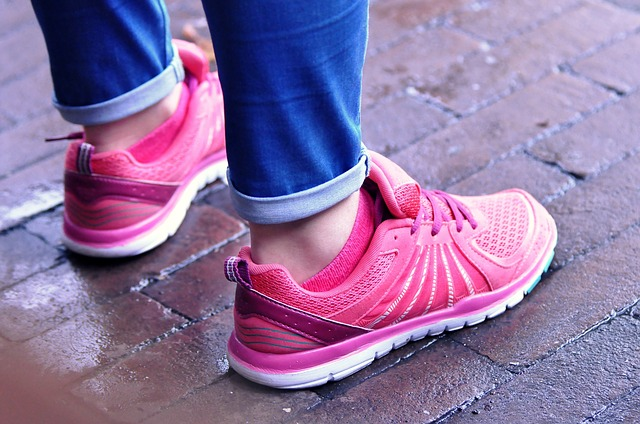
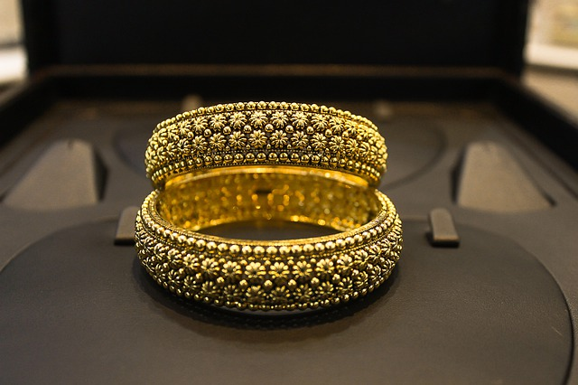

# masonry-layout
A practical application of the masonry grid layout.

At the end of this read you will be able to

1. Understand the basics and whats masonry layout is all about.
2. Implement masonry layout with little or no help

Prerequisite: knowledge of HTML and CSS

Masonry layout is coined from the pattern a mason lays his bricks during constructions.

This layout comes in very handy when designing for collections(images, text, cards containing both) of different lengths and widths.

The concept is to maintain a certain width and allow them take up the height available to them.

#### First Steps:
First of all, let’s create two new files:

index.html

css/masonry-layout.css

also create a img directory.

find sample images is used here!

Add to index.html the reference to the style sheet:

__The index.html file as follows__

```
<!DOCTYPE html>
<html lang="en">

<head>
  <meta charset="UTF-8">
  <meta name="viewport" content="width=device-width, initial-scale=1.0">
  <meta http-equiv="X-UA-Compatible" content="ie=edge">
  <link rel='stylesheet' href="./css/masonry-layout.css" />
  <title>Masonry Layout</title>
</head>
<body>
  <div class="container">
    <h2 class='welcome'>Masonry layout with pure css!</h2>
  </div>
  <div class="container masonry-bricks-container">
    
    
    
    
    
    
    
    
    
    
    
    
    
    
    
    
    
    
    
    
  </div>
</body>
</html>
```

It's important to note that the images should be of different height(and width).

__The css/masonry-layout.css file__

````
* {
  box-sizing: border-box;
  padding: 0;
  margin: 0;
}

html,
body {
  font-family: 'Lucida Sans', 'Lucida Sans Regular', 'Lucida Grande',
    'Lucida Sans Unicode', Geneva, Verdana, sans-serif;
  height: 100%;
}

.welcome {
  padding: 30px 0;
}

.container {
  max-width: 80vw;
  margin: 0 auto;
}

/*  the styles applied above this line are optional and
*   are not directly related to *  the masonry lesson */

/* mason layout with pure css */
.masonry-bricks-container {
  padding: .4em 0;
  column-count: 4;
  column-gap: .5rem;
}

.masonry-bricks-container img {
  width: 100%;
  height: 100%;
  max-width: 100%;
  object-fit: cover;
  border-radius: 2px;
  break-inside: avoid;
  margin-bottom: .4rem;
}
````

And here is the final result

image goes here


The whole code can be found here.